  

 

  CS &amp; Engineering @ <a href="https://www.insa-lyon.fr/">INSA Lyon</a>
  · competitive programming
  · open source on GitHub

---

### About

Fourth-year CS student focused on algorithms, systems, and shipping useful code.
On GitHub that means frequent commits, pull requests, and community tooling —
including work around **INSAlgo** and contest software.

- ICPC competitor (2024, 2025) — 2nd in France; SWERC & European Championship
- Match'Up Coding Battle 2022 winner
- 4× Prologin finalist (2021–2025)

---

  

<!-- DYNAMIC:PINNED:START -->

### Featured repositories

**[OpenTrade](https://github.com/WiredMind2/OpenTrade)** — A comprehensive Python system for algorithmic trading backtesting with sentimen…  
`★ 0 · Python`

**[Chess2](https://github.com/WiredMind2/Chess2)** — A C++ implementation of a three-player chess game on a hexagonal board, featuri…  
`★ 1 · C++`

**[AnimeManager](https://github.com/WiredMind2/AnimeManager)** — AnimeManager is a Python streaming application that also handles anime discover…  
`★ 1 · Python`

**[C-Compiler](https://github.com/WiredMind2/C-Compiler)** — Pinned repository  
`★ 1 · C++`

<!-- DYNAMIC:PINNED:END -->

---

  <a href="https://github.com/WiredMind2">github.com/WiredMind2</a>
  ·
  <a href="https://tetrazero.com">tetrazero.com</a>

